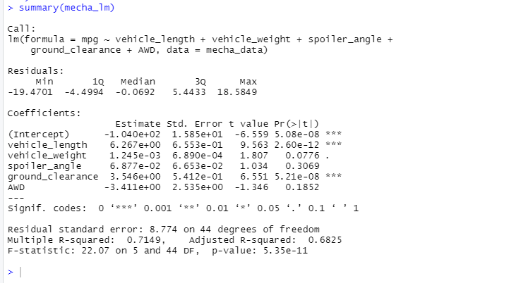
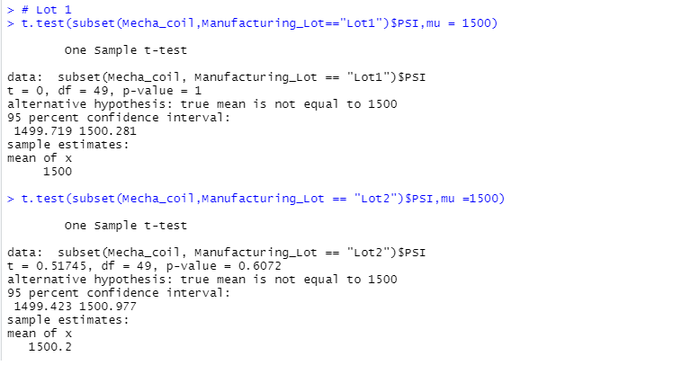
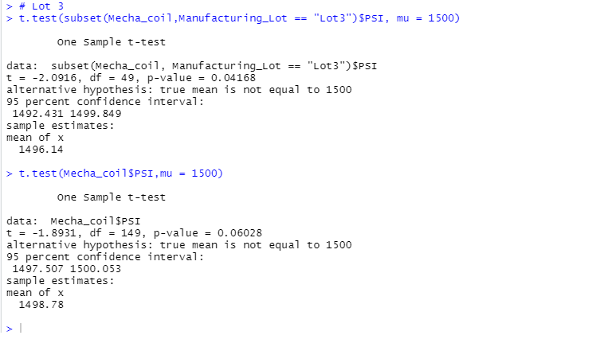

# MechaCar_Statistical_Analysis
## D1 Linear Regression to Predict MPG

Q1-
According to the dataset results, the ground clearance and vehicle length have a significant impact on mpg.

Q2- 
According to the multiple linear regression model, the slope of the linear model is not considered to be zero because the standard error of the estimates and the "t-value" are both provided to show how the p-value is calculated. 
In the summary output, the actual p-value of the hypothesis test was 5.35e-11, which is smaller than the 0.05 significance level. That means that the linear regression model gives us reliable estimates. 

Q3-
According to the summary output, the multiple regression model does an adequate job of predicting the mpg of MechaCar prototypes 
because the multiple r-squared value was 0.71 while the p-value remained significant. This means that roughly 71% of the time, the model will 
predict mpg values correctly. Most likely, other, more influential variables and factors were not recorded in the data set, contributing to the change in mpg for the mechanical prototype.

## D2 The design specifications
The design specifications for the MechaCar suspension coils dictate that the variance of the suspension coils must not exceed 100 pounds per square inch. Does the current manufacturing data meet this design specification for all manufacturing lots in total and each lot individually? Why or why not?

lot summary $Total summary :

Lot 1 and Lot 2 are both within design specifications, and both have the same calculated mean and median. However, Lot 3 is far more variable than the other manufacturing lots.  Lot 3 has a computed variance that exceeds the manufacturing specs to 170.3 PSI.  However, if all three lot combines, the overall calculated variance (62.3PSI) is within specifications.

## D3 T-Tests on Suspension Coils

According to each of the one-sample t-tests, Lot 1 and Lot 2 PSI values are not statistically different from the population mean. 

The p-value of Lot 3 is 0.041, which is below the significance level, which means there is evidence that the Lot 3 mean suspension coil PSI is statistically different from the population mean.

## D4 Study Design: MechaCar vs Competition
the Union Concerned Scientists survey article shows there is strong support for electric cars and the most of reason for that is : 

•	73 percent say increased electric car use will help reduce oil use.

•	72 percent say increased electric car use will help reduce pollution.

•	65 percent say electric cars will help consumers save money on fuel and maintenance. (2019, https://www.ucsusa.org/about/news/survey-shows-strong-support-electric-vehicles )

Suppose MechaCar could produce fuel efficiency(electric or hybrid) performance cars highly at affordable prices for society and help reduce oil use, reduce pollution, and save on fuel and maintenances. In that case, the market demand will be skyrocket high.

As far as we know that fuel efficiency is a standard performance metric. Therefore it would be straightforward to collect fuel efficiency data for a large number of vehicles. We can create a study that tests whether or not the fuel efficiency of MechaCar is statistically different from a collection of other comparable cars such as Tesla.

The null hypothesis would be that there is no statistical difference between MechaCar fuel efficiency and the fuel efficiency of all other comparable vehicles. The alternative hypothesis would be a statistical difference between the fuel efficiency of MechaCar versus the other cars. 

The statistical test we can use is a one-sample t-test, where the population data will be all comparable vehicles. To test this, we will need fuel efficiency data points from cars and multiple data points from the MechaCar cars, so it will be vital to include the fuel efficiency of multiple vehicle configurations.

## Software
Rstudio
